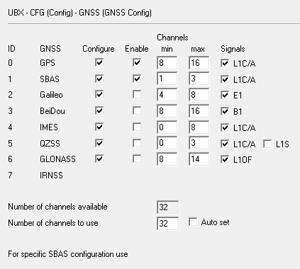
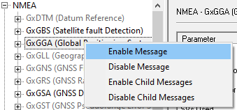
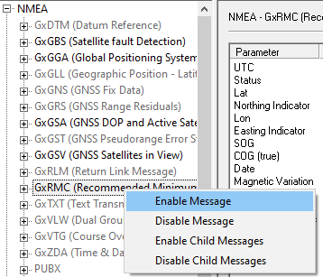
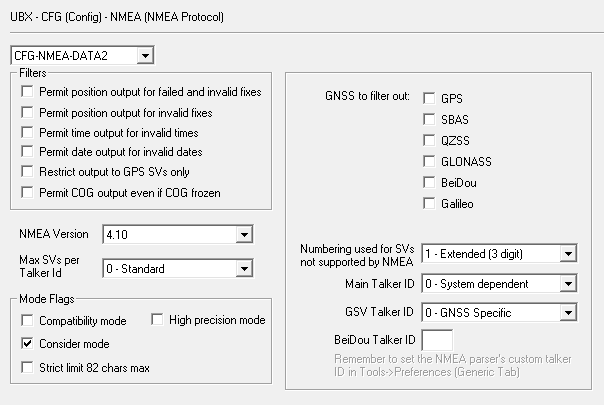
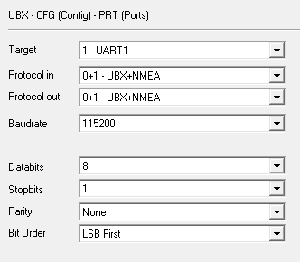
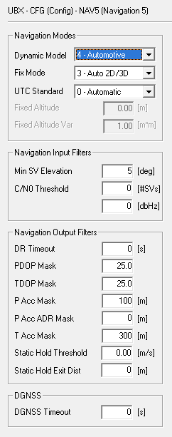
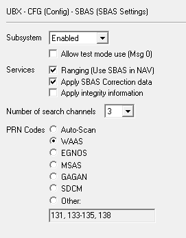
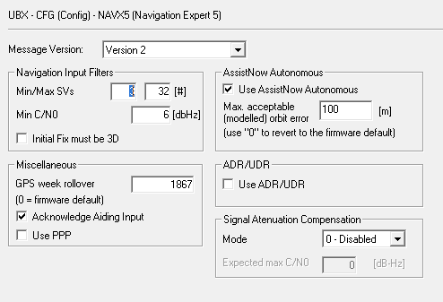
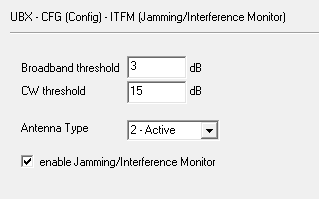
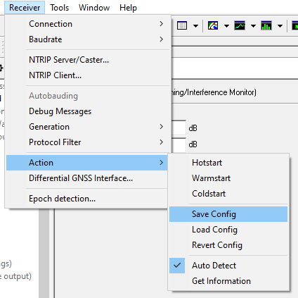

# Which GPS receiver?

- [FAQ](#faq)
  - [Q: Can I use a cheaper Neo-6M module?](#q-can-i-use-a-cheaper-neo-6m-module)
  - [Q: Can I use a newer Neo-9M module?](#q-can-i-use-a-newer-neo-9m-module)
  - [Q: What modules are recommended?](#q-what-modules-are-recommended)
  - [Q: No data is made available to my apps, what's wrong?](#q-no-data-is-made-available-to-my-apps-whats-wrong)
  - [Q: M8N, M8Q, M8U .. which one?](#q-m8n-m8q-m8u--which-one)
- [Comparison of performance vs precision](#comparison-of-performance-vs-precision)
  - [3 hours of measurements side by side](#3-hours-of-measurements-side-by-side)
- [GPS modules setup via presaved configuration](#gps-modules-setup-via-presaved-configuration)
- [Setup on your own, step by step](#setup-on-your-own-step-by-step)
  - [Settings that are required](#settings-that-are-required)
    - [UBX-CFG-GNSS](#ubx-cfg-gnss)
    - [UBX-CFG-MSG](#ubx-cfg-msg)
    - [UBX-CFG-NMEA](#ubx-cfg-nmea)
    - [UBX-CFG-PRT](#ubx-cfg-prt)
    - [UBX-CFG-NAV5](#ubx-cfg-nav5)
  - [Settings to optimize performances](#settings-to-optimize-performances)
    - [UBX-CFG-RATE](#ubx-cfg-rate)
    - [UBX-CFG-PMS](#ubx-cfg-pms)
    - [UBX-CFG-SBAS](#ubx-cfg-sbas)
    - [UBX-CFG-NAVX5](#ubx-cfg-navx5)
    - [UBX-CFG-ITFM](#ubx-cfg-itfm)
  - [Messages that do not required changes](#messages-that-do-not-required-changes)
  - [Save Configuration](#save-configuration)
- [References](#references)

This project requires a receiver compatible with ublox M8, for the following reasons

- it's widely available as it's used in avionics (drones) projects
- it's cost effective
- it allows 10Hz refresh rate
- it allows granular configuration of NMEA messages

## FAQ

### Q: Can I use a cheaper Neo-6M module?

**A:** not really, as it gives a max of 5Hz frequency and its performance are far less than a Neo-8M module for a fraction more of the cost

### Q: Can I use a newer Neo-9M module?

**A:** It could work, but this project is not tested for it yet.

### Q: What modules are recommended?

**A:** Genuine ublox M8 are best, with an active antenna that is tuned for GPS+Glonass+Galileo. Too much to say about this subject.

### Q: No data is made available to my apps, what's wrong?

**A:** First thing to check is: is the PORT RATE stored in your GPS (see below paragraph **UBX-CFG-PRT**) matching the one expected by the bonogps.cpp code in macro `GPS_STANDARD_BAUD_RATE` ? It should be 115200. Open an issue otherwise so that we can work out troubleshooting

### Q: M8N, M8Q, M8U .. which one?

**A:** According to the [NEO-M8-FW3 datasheet](https://www.u-blox.com/sites/default/files/NEO-M8-FW3_DataSheet_%28UBX-15031086%29.pdf), you should avoid NEO-M8N as it's limited to 5 Hz for 2 or more concurrent constellations (e.g. GPS+<GLONASS/Galileo> or even all three). NEO-M8Q and NEO-M8M have 10Hz for multiple constellations, and 18Hz for a single one. Read up [here](https://discuss.ardupilot.org/t/gps-config-u-blox-m8n/46970/34) as well.

## Comparison of performance vs precision

A comparison in a static location with clear sky among performances (speed = navigation rate, intesity = SV CN0) and precision (HDOP) shows that

- BN220, with a passive antenna, has the lower quality of signal: this means it might have difficulties when visibility is not great. It can handle 10Hz with GPS+GLONASS+Galileo, 18Hz with GPS Only. C/n0 is around 30 dBHz in all cases;
- BN880, with an active antenna and same computing unit as BN220, improves SV CN0 significantly: between 30 and 35 dBHz;
-M8N, with an active antenna and legitimate ublox chipset, has the best SV CN0 (between 35 dBHz and 40 dBHz) and precision, at the cost of a slow update rate: 10Hz with only GPS, 5Hz with GPS+another, even less with Galileo.

As noted in several sources, Galileo is now proving to add better precision than GLONASS.

### 3 hours of measurements side by side


## GPS modules setup via presaved configuration

To reduce complexity of this software, you need to save a baseline configuration of your GPS module. Parameters include

- default port speed (it should match GPS_STANDARD_BAUD_RATE, starting from v1.1 there is a basic auto baud rate detection)
- what satellite systems to use (GPS, Glonass, Galileo, BeiDou)
- what Wide Area Augmentation System to be used
- disable all unnecessary NMEA messages
- set motion defaults

... etc.

_Note: these instructions are specific to a GPS module compatile with ublox 8 messages._

You can setup an out of the box M8 module restoring one of these saved configurations:

- passive antenna [BN220](gps-bn220-config.txt)
- active antenna [BN820](gps-bn880-config.txt)

The procedure is

1. Connect the receiver to your PC (a FTDI USB to TTL module comes handy, the same one used to program arduino boards without USB ports, [example](https://www.amazon.com/s?k=ftdi+usb+to+serial&i=electronics&ref=nb_sb_noss_1) );
2. Open U-Center and connect to the serial device used at step 1 (you can configure correct COM port and Baudrate under Reciever tab);
3. Go to Tools -> GNSS Configuration or Tools -> Reciever Configuration, depending on your U-Center version;
4. Find one of the saved configuration files in this folder;
5. Select your GPS module series (BN220 and BN820 is M8);
6. Select "Store Configrations into BBR/Flash';
7. Click 'File > GNSS'.

at this point the configuration is stored on your device in its flash memory. Please note some cheap GPS receiver modules do not have flash memory and they will not work for this project.

The example configuration offered in this repo configures the default baudrate of GPS receiver at 115200 (which is expected baudrate by bongogps software), but sometimes GPS receiver has factory 9600 baudrate. This will lead to connection errors as soon as U-Center applies the baudrate setting. So, once you'll start receiving connection errors, configure baudrate to 115200 via (Reciever -> Baudrate). After that, the flashing should continue normally.

Save configuration is notably (as is - several sources say so and I find it as well) unreliable, so please run it more than a few times and check that settins have actually been saved across resets/power downs.

## Setup on your own, step by step

### Settings that are required

After an established connection with your GPS, open 'View > Messages' or press F9


then go the UBX section


#### UBX-CFG-GNSS

More satellites and constellations (GPS, Galileo, GLONASS) does not necessarily mean better results: hardware here limits performances, so you might have to compromise speed for amount of data.

There is plenty of information online on drone GPS solutions that explain the optimal update rate for each hardware (e.g. [ArduPilot](https://github.com/ArduPilot/ardupilot/issues/13053)).

Configurations tested, optimized for Americas:

- BN-880, BN220, NEO-M8Q, NEO-M8M and other devices capable of 10Hz with 2+ constellations: Enable GPS, SBAS, Galileo, Glonass


- NEO-M8N: GPS, SBAS (unless you are happy with 5Hz, then you can enable additional ones)



Common

- BeiDou has good coverage in APAC, so disabled for NAMER to use Galileo+Glonass
- IMES disabled as ineffective for this use
- QZSS disabled as it is specific for APAC

##### GPS, SBAS

E.g. to use 10Hz on M8N

```text
B5 62 06 3E 3C 00 00 00 20 07 00 08 10 00 01
00 01 01 01 01 03 00 01 00 01 01 02 04 08 00
00 00 01 01 03 08 10 00 00 00 01 01 04 00 08
00 00 00 01 01 05 00 03 00 00 00 01 01 06 08
0E 00 00 00 01 01 2D 79
```

##### GPS, SBAS, Galileo, GLONASS

BN-880, BN-220, M8Q and other devices at 10Hz with multiple constellations

```text
B5 62 06 3E 3C 00 00 20 20 07 00 08 10 00 01
00 01 01 01 01 03 00 01 00 01 01 02 04 08 00
01 00 01 01 03 08 10 00 00 00 01 01 04 00 08
00 00 00 01 03 05 00 03 00 00 00 01 05 06 08
0E 00 01 00 01 01
```

#### UBX-CFG-MSG

- First disable all messages (click on the top level node NMEA, right click -> 'Disable child messages')


- Enable `GxGGA` and `GxRMC` messages





Disable all messages

```text
B5 62 06 01 03 00 F0 0A 00 04 23
B5 62 06 01 03 00 F0 09 00 03 21
B5 62 06 01 03 00 F0 00 00 FA 0F
B5 62 06 01 03 00 F0 01 00 FB 11
B5 62 06 01 03 00 F0 0D 00 07 29
B5 62 06 01 03 00 F0 06 00 00 1B
B5 62 06 01 03 00 F0 02 00 FC 13
B5 62 06 01 03 00 F0 07 00 01 1D
B5 62 06 01 03 00 F0 03 00 FD 15
B5 62 06 01 03 00 F0 0F 00 09 2D
B5 62 06 01 03 00 F0 04 00 FE 17
B5 62 06 01 03 00 F0 05 00 FF 19
B5 62 06 01 03 00 F0 08 00 02 1F
B5 62 06 01 03 00 F1 00 00 FB 12
B5 62 06 01 03 00 F1 01 00 FC 14
B5 62 06 01 03 00 F1 03 00 FE 18
B5 62 06 01 03 00 F1 04 00 FF 1A
B5 62 06 01 03 00 F1 05 00 00 1C
B5 62 06 01 03 00 F1 06 00 01 1E
```

Enable `GGA`

```text
B5 62 06 01 03 00 F0 00 01 FB 10
```

then enable `RMC`

```text
B5 62 06 01 03 00 F0 04 01 FF 18
```

#### UBX-CFG-NMEA

This is automatically set when changing the number of SV's, no need to set it

- NMEA messages: 4.10 format
- Max SVs `0 - Standard`
- Mode Flags: Consider Mode checked
- Numbering used for SVs not supported by NMEA: `1 - Extended (3 digit)`
- Main Talker ID `0 - System dependent`
- GSV Talker ID `0 - GNSS Specific`

If you are using BeiDou, there might be additional configuration required



```text
B5 62 06 17 14 00 00 41 00 02 00 00 00 00 01
00 00 01 00 00 00 00 00 00 00 00 76 63
```

#### UBX-CFG-PRT

go to UBX > CFG > PRT (Port) node and for Target 1 set

- Protocol In: `0+1 UBX+MNEA`
- Protocol Out: `0+1 UBX+MNEA`
- Baudrate: `115200`
  
Version 1 required a predefine Baudrate, but it caused issues when a temporary value was changed, so from version 1.1 BonoGPS tries to automatically set the baud rate.

If you have long cables, you might want to test `56k`



```text
B5 62 06 00 14 00 01 00 00 00 D0 08 00 00 00
C2 01 00 03 00 03 00 00 00 00 00 BC 5E 
```

#### UBX-CFG-NAV5

The default configuration of these GPS receiver is optimized for pedestrian or slowly moving vehicles. We can suggest parameters that are a better fit for a fast vehicle

- Dynamic model -> 4 Automotive



```text
B5 62 06 24 24 00 FF FF 04 03 00 00 00 00 10
27 00 00 05 00 FA 00 FA 00 64 00 2C 01 00 00  
00 00 00 00 00 00 00 00 00 00 00 00 14 98
```

### Settings to optimize performances

#### UBX-CFG-RATE

This is automatically set by the configuration portal, no need to set it. For 10Hz

- Time Source `0 - UTC Time` (not sure if `1 - GPS` is a better option)
- Measurement Period `100 ms`


```text
B5 62 06 08 06 00 64 00 01 00 00 00 79 10
```

On BN220 and other devices that can handle > 10 Hz, you can use 18Hz (not supported by the configuration portal right now)

```text
B5 62 06 08 06 00 37 00 01 00 00 00 4C 02
```

#### UBX-CFG-PMS

This sets optimal performances, sacrificing battery life

- Set `0 - Full Power`, and `Save Configuration`


```text
B5 62 06 86 08 00 00 00 00 00 00 00 00 00 94 5A
```

then

```text
B5 62 06 09 0D 00 00 00 00 00 FF FF 00 00 00 00 
00 00 07 21 AF
```

#### UBX-CFG-SBAS

- Enable SBAS
- Turn on Ranging, Correction Data
- If you are using GPS only, then you should enable Integrity information
- Number of search channels = 3 is configured in the CFG-GNSS panel
- Set SBAS specific to your region: use the PRN Codes WAAS for Americas, EGNOS for Europe. Auto-scan will identify them by itself at the cost of a longer startup time

##### Without Integrity, WAAS for Americas



```text
B5 62 06 16 08 00 01 03 03 00 00 E8 04 00 17 79
```

##### With Integrity, WAAS for Americas

```text
B5 62 06 16 08 00 01 07 03 00 00 E8 04 00 1B 95
```

#### UBX-CFG-NAVX5

- Message Version 2 (the default)
- AssistNow Autonomous `Use AssistNow Autonomous`



```text
B5 62 06 23 28 00 02 00 4C 66 C0 00 00 00
00 00 03 20 06 00 00 00 00 01 4B 07 00 00
00 00 00 00 00 01 00 00 64 00 00 00 00 00
00 00 00 00 A6 82
```

#### UBX-CFG-ITFM

- Enable jamming and interference

##### With Active Antenna (e.g. BN-880)



```text
B5 62 06 39 08 00 F3 AC 62 AD 1E 63 00 00 76 A5
```

##### With Passive Antenna (e.g. BN-220)


```text
B5 62 06 39 08 00 F3 AC 62 AD 1E 53 00 00 66 75
```

### Messages that do not required changes

- CFG-ANT
- CFG-DAT
- CFG-INF
- CFG-ODO
- CFG-PM2 *-> use UBX-CFG-PMS instead*
- CFG-RXM *-> use UBX-CFG-PMS instead*
- CFG-TP5
- CFG-USB
- CFG-LOGFILTER

### Save Configuration

- Open menu "Receiver > Action > Save config"



or issue

```text
B5 62 06 09 0D 00 00 00 00 00 FF FF 00 00 00 00 00 00 17 31 BF
```

## References

- [ublox M8 Receiver description](https://www.u-blox.com/sites/default/files/products/documents/u-blox8-M8_ReceiverDescrProtSpec_%28UBX-13003221%29.pdf)
- [Assist Now](https://portal.u-blox.com/s/question/0D52p00008eSdzE/how-to-enable-and-flash-assistnow-autonomous-on-zoem8b)
- [SBAS](https://github.com/cleanflight/cleanflight/blob/master/docs/Gps.md)
- [Enable Galileo](https://github.com/iNavFlight/inav/wiki/Ublox-3.01-firmware-and-Galileo)
- [UBX Tool](https://gpsd.io/ubxtool-examples.html)
- Setting PORT, Frequency and save settings from [freematics](https://freematics.com/forum/viewtopic.php?t=1759)
- [https://learn.sparkfun.com/tutorials/getting-started-with-u-center-for-u-blox/all](https://learn.sparkfun.com/tutorials/getting-started-with-u-center-for-u-blox/all)
