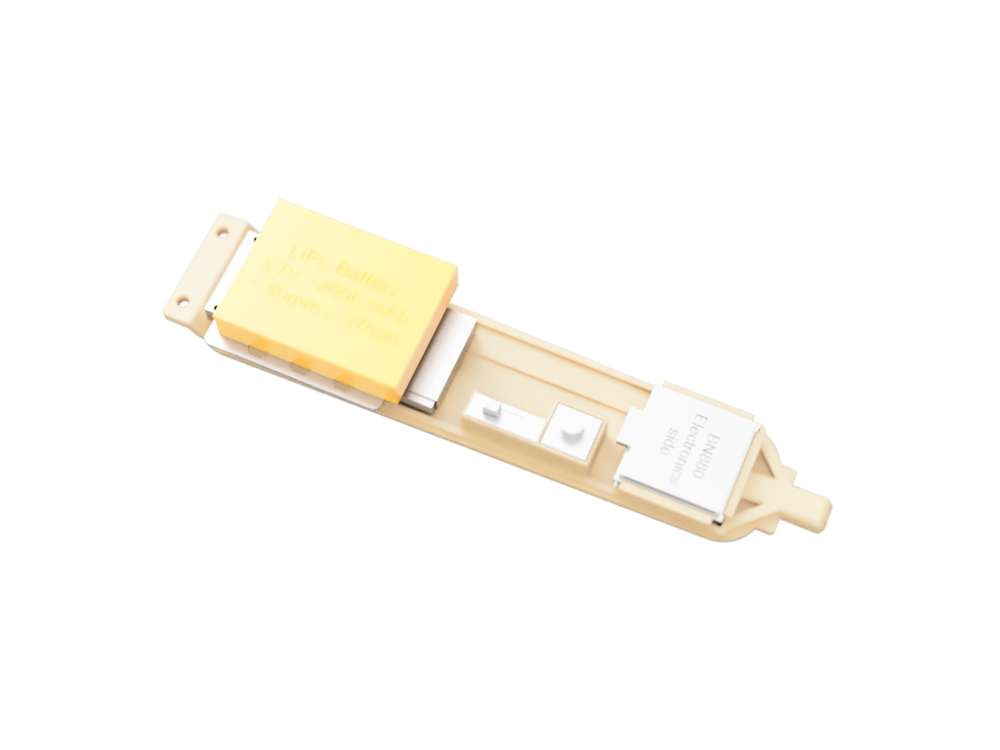
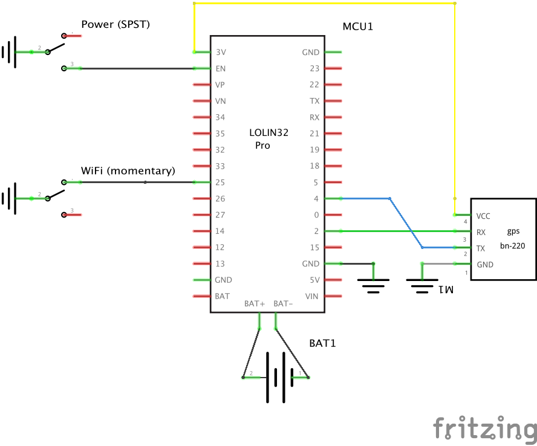
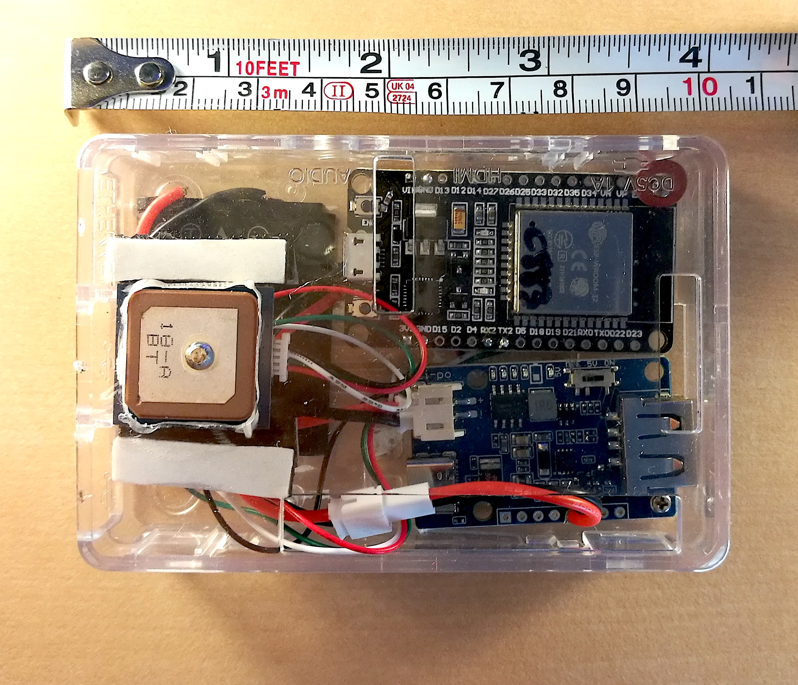
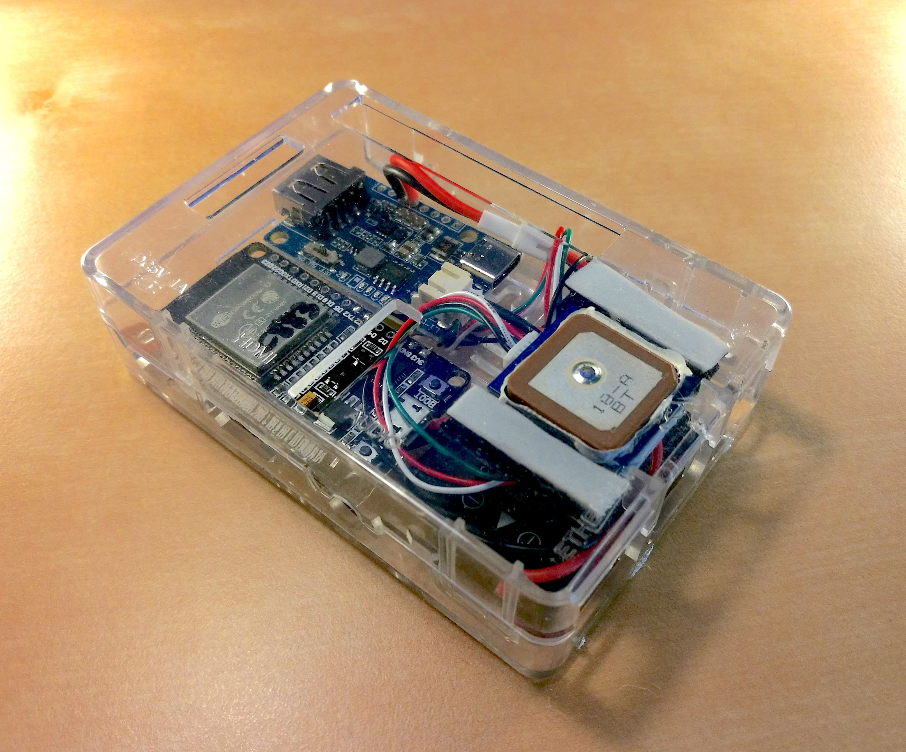

# A couple of working prototypes that don't look fancy but get the job done

- [Integrated in seat cowl (with BN880) of a Ducati Panigale 959 with 3d printed base](#integrated-in-seat-cowl-with-bn880-of-a-ducati-panigale-959-with-3d-printed-base)
  - [Rendering of 3d model](#rendering-of-3d-model)
  - [Picture of installed model](#picture-of-installed-model)
  - [3d printing](#3d-printing)
- [Trasparent case (with BN220)](#trasparent-case-with-bn220)

Hardware is similar for both and it's mostly based on things I could easily find:

- basic [ESP32 DEVKIT](https://www.amazon.com/D-FLIFE-Development-Dual-Mode-Microcontroller-Integrated/dp/B08DR31G4G) board
- seedstudio [LiPo Rider Plus](https://wiki.seeedstudio.com/Lipo-Rider-Plus/) charger (Why? The first LiPo charger I bumped into at MicroCenter while shopping with a couple of nice features such as fuel gauge)
- [BN220](https://www.amazon.com/Beitian-Navigation-Raspberry-Betaflight-Aircraft/dp/B07WM1GFY8) or [BN880](https://www.amazon.com/Geekstory-Navigation-Raspberry-Aircraft-Controller/dp/B078Y6323W) (better as it has an active antenna) GPS
- Li-Ion battery
- [JST2.0 cables](https://www.amazon.com/gp/product/B07NWD5NTN/ref=ppx_yo_dt_b_asin_title_o05_s00?ie=UTF8&psc=1) to connect battery to LiPo charger and LiPo charger to ESP32 power inputs (Vin, GND)

In one case, the unit is assembled within a left-over raspberry pi case (the transparent case helps in checking the light status).

Another supported board is [Wemos/LOLIN D32 Pro](https://www.wemos.cc/en/latest/d32/d32_pro.html) which has some benefits

- integrated LiPo charger
- more flash memory and PSRAM
- SD slot builtin

This software runs on it (be sure to select it within the Arduino IDE or to use the tasks named 'lolind32pro' within PlatformIO or to select the right definition in [include/bonogps_board_settings.h](include/bonogps_board_settings.h))

## Integrated in seat cowl (with BN880) of a Ducati Panigale 959 with 3d printed base

The GPS antenna is underneath the very end of the tail, with minimal plastic over it and with the best clear line of sight of any other location on the bike.

A simple 3d printed board is used to hold all components in place

- GPS: BN880
- ESP32: Lolin d32pro
- LiPo Battery (2000 mAh will last a full day of riding)
- A small on/off button
- A momentary button to serve as WiFi mode selection button (equivalent to BOOT on other ESP32 models)

### Rendering of 3d model

### Picture of installed model

### 3d printing

- [base board](bonogps_panigale_baseboard.stl)
- [battery slider](bonogps_panigale_battery_slider.stl)

If you have different components, [source files for Fusion3d are also available](BonoGPS%20-%20Panigale%20899%201199%20959%201299.f3d).

Schematics are simple:

- a GPS serial connection TX+RX and its power
- a on/off switch that disables power to the internal Lolin D32 Pro regulator
- a momentary switch to act as WiFi mode selector, in lieu of a Boot button

Steps - [here a video of how all pieces fit together](959%20under%20tail%20v11.mp4)

- print the base board
- print the battery slider
- connect/solder the connector cables between esp32 and GPS (4 wires): VCC to 3V, RX to pin 0, TX to pin 4, GND to GND
- connect/solder micro on/off switch and momentary button cables (leave cables open on the end towards esp32) (3 wires). The on/off connects GND to EN pin or it leaves it open, the momentary button connects pin 25 to GND
- connect/solder the open end of cables for switches to esp32
- mount the esp32 in place with 3 small screws (I suggest M1.7)
- slide in BN880
- connect the BN880 with its connector
- use a zip tie or double sided tape or strong velcro to hold the battery on the battery slider
- carefully slide in the battery slider and make sure it holds its place: this is delicate so make sure you don't break the support structures
- connect the LiPo JST battery

.. and you are done! Don'f forget you need to store a base configuration on your GPS before it's ready for use (check [GPS configuration](../GPS/README.md))

## Trasparent case (with BN220)

A small 650mAh battery gives ~ 4 hrs of autonomy, I repurposed one that was supposed to be used for a digital camera

I used double sided tape to attach this on top of a back seat/seat cowl or to secure it inside the fairing: an example for a Ducati Panigale 959/1299 here below:

