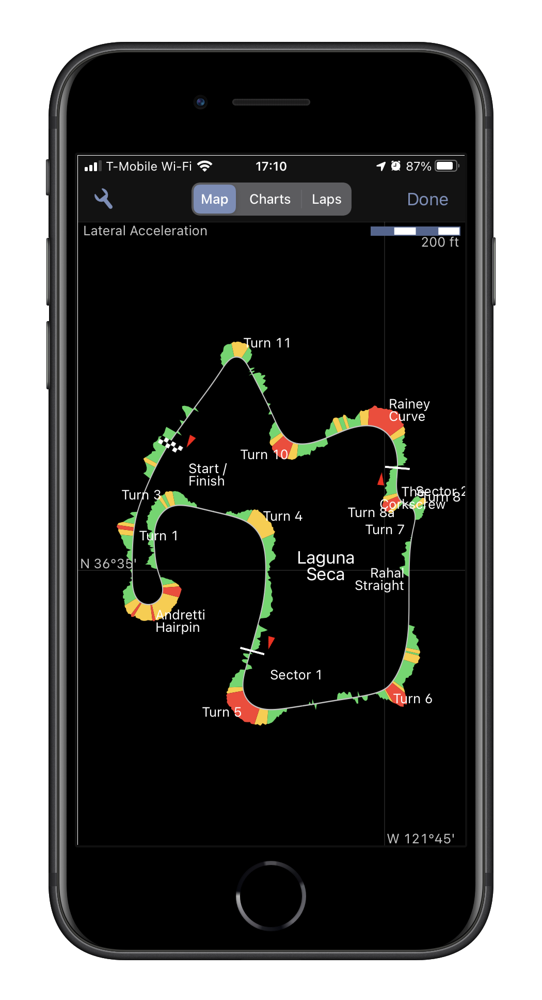
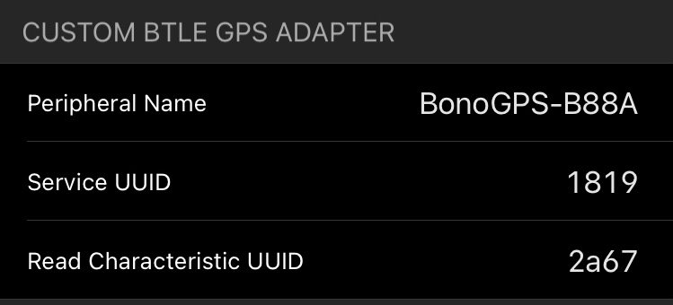
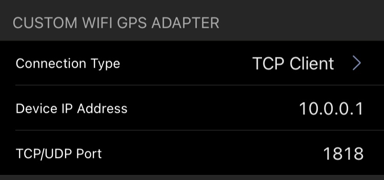

# Connecting to Harry's LapTimer

More info at [https://www.gps-laptimer.de/](https://www.gps-laptimer.de/), where you can also find a very good user and developer forum. It offers the largest set of customizable options to build your own external device and it is the only supported platform for iOS phones via Bluetooth Low Energy.

Features:

 - NMEA parsing offered by HLT directly: RMC+GGA messages
 - Enable or Disable GSV/GSA as needed, with a lower update frequency selectable for 1, 2, or 5 sec (as [instructed by Harry](http://forum.gps-laptimer.de/viewtopic.php?t=4359))
 - tested with v24

Connections
 
 - iOS and Android: TCP/IP port 8118
 - iOS: BLE atested on iPhone (tested with 7). BLE handles 5Hz and 10Hz  when GSV/GSA streaming disabled, ok with polling at low frequencies (e.g. every few seconds)
 - Anroid: BT-SPP tested on Android

 
After configuring the connection, your unit shows up in the Sensors List as 'Custom [BTLE/TCP-IP] GNSS' device

now you can open the '**GPS**' page and check that you are receiving valid GPS data

with a paid add-on, you can also see the satellites constellation map

## iOS Bluetooth Low Energy setup

Go to *Administration > Settings > Expert Settings* and

- within 'accessory tweaks', turn on 'Use Bluetooth LE Sensors'
- within 'custom btle gps adapter', set 'Peripheral Name' to `BonoGPS-XXXX` where `XXXX` is the id of your device as shown in the title of the configuration page
- within 'custom btle gps adapter', set 'Service UUID' to  **1819** (standard for `SERVICE_LOCATION_AND_NAVIGATION_UUID`)
- within 'custom btle gps adapter', set 'Read Characteristic UUID' **2A67** (standard for `CHARACTERISTIC_LOCATION_AND_SPEED_CHARACTERISTIC_UUID`)

## iOS and Android TCP/IP setup

Go to *Administration > Settings > Expert Settings* and

- within 'accessory tweaks', turn on 'Use Wi-Fi Sensors'
- within 'custom wifi gps adapter', set Connection Type `TCP/IP`, 'Device IP Address' to `10.0.0.1`, TCP Port to `1818`

## Android BT-SPP Setup

To be completed
